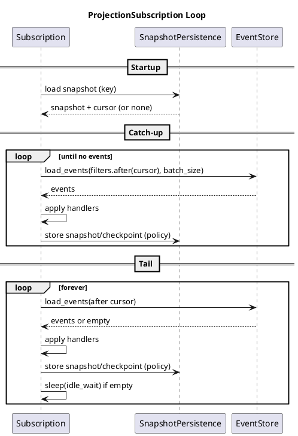

# Real-Time Subscriptions Design

> Note: This is a historical design document and does not reflect the current
> public API shape in all details.

This document proposes a production-grade design for real-time projection
subscriptions in Sourcery. It contrasts the current state with a proposed
architecture that supports per-projection snapshot policies and filtered,
incremental subscriptions.

The goal is to optimize for:
- Low-latency updates for read models
- Scalable incremental catch-up
- Per-projection snapshot cadence
- Clear separation of "persistence" vs "policy"

This document does not address migration or backward compatibility.

---

## Current State (Today)

### Behavior
- Projections are rebuilt by `ProjectionBuilder::load()`, which replays all
  matching events.
- Optional snapshot support uses `ProjectionBuilder::with_snapshot()`, but
  the policy for when to snapshot is owned by the snapshot store itself.
- The repository owns a single snapshot store, so policy is effectively global.
- There is no built-in subscription/runner for incremental updates.

### Implications
- Rebuild cost grows with event count.
- "Real-time" updates require app-level polling and reloading.
- Snapshot cadence is global, not projection-specific.
- There is no standardized pattern for filtered subscriptions (by event kind,
  by aggregate instance, etc.).

### Current Architecture (Diagram)

```d2
direction: right

app: "Application" {
  handler: "Command Handler"
  reader: "Projection Reader"
}

repo: "Repository" {
  execute: "execute_command"
  load_proj: "build_projection/load"
}

store: "EventStore"
snap: "SnapshotStore\n(policy inside store)"

app.handler -> repo.execute -> store
app.reader -> repo.load_proj -> store
repo.load_proj -> snap: "load snapshot\n(policy inside store)"
```

---

## Proposed Design (Best-Case)

### Overview
Introduce a first-class **Projection Subscription** runner that:
- Uses the existing `ProjectionBuilder` filters and handlers.
- Supports incremental catch-up and low-latency tailing.
- Stores projection snapshots and/or checkpoints based on **per-projection
  policy**.

### Core Changes

1) **Split snapshot persistence from snapshot policy**
   - Persistence: how snapshots are stored (DB/table/schema).
   - Policy: when snapshots are taken.

2) **ProjectionSubscription** runner
   - Captures filters/handlers from `ProjectionBuilder`.
   - Runs a loop: load snapshot -> catch up -> tail -> checkpoint.

3) **Per-projection policy**
   - Each projection instance can tune cadence:
     - snapshot every N events
     - checkpoint every M events
     - batch size, idle wait, etc.

4) **Filtered subscriptions**
   - Reuses `ProjectionBuilder` filters:
     - `event::<E>()`
     - `events::<Enum>()`
     - `event_for::<A, E>(&id)`
     - `events_for::<A>(&id)`

### Proposed Architecture (Diagram)

```d2
direction: right

app: "Application" {
  handler: "Command Handler"
  sub: "ProjectionSubscription"
}

repo: "Repository"
store: "EventStore"
snap_persist: "SnapshotPersistence"
snap_policy: "SnapshotPolicy\n(per projection)"

app.handler -> repo -> store: "commit events"

app.sub -> store: "load events after cursor\n(filtered)"
app.sub -> snap_persist: "load/store snapshot"
app.sub -> snap_policy: "decide when to snapshot"
```

---

## Component Details

### 1) Snapshot Persistence vs Policy

**SnapshotPersistence** (new):
- Responsible for loading/storing serialized snapshot data
- No cadence logic

**SnapshotPolicy** (new):
- Decides when to snapshot for a specific projection instance
- Can be configured per projection

Example trait split:

```rust
pub trait SnapshotPersistence<K>: Send + Sync {
    type Position: Send + Sync;
    type Error: std::error::Error + Send + Sync + 'static;

    fn load<T: DeserializeOwned>(
        &self,
        key: &K,
    ) -> impl Future<Output = Result<Option<Snapshot<Self::Position, T>>, Self::Error>> + Send;

    fn store<T: Serialize>(
        &self,
        key: &K,
        snapshot: Snapshot<Self::Position, T>,
    ) -> impl Future<Output = Result<(), Self::Error>> + Send;
}

pub trait SnapshotPolicy: Send + Sync {
    fn should_snapshot(&self, events_since_last: u64) -> bool;
}
```

### 2) ProjectionSubscription

The subscription uses:
- Filters and handlers from `ProjectionBuilder`
- A `SnapshotPersistence` implementation
- A per-projection `SnapshotPolicy`

Example API:

```rust
pub struct ProjectionPolicy {
    pub batch_size: usize,
    pub snapshot_every: u64,
    pub checkpoint_every: u64,
    pub idle_wait: Duration,
}

pub struct ProjectionSubscription<'a, S, P, SP>
where
    S: EventStore,
    P: Projection<Id = S::Id>,
    SP: SnapshotPersistence<ProjectionKey>,
{
    store: &'a S,
    persistence: &'a SP,
    policy: ProjectionPolicy,
    filters: Vec<EventFilter<S::Id, S::Position>>,
    handlers: HashMap<&'a str, EventHandler<P, S>>,
}
```

### 3) Projection Checkpoints

Each projection instance stores a cursor (global position) alongside its
state. This enables incremental catch-up and tailing.

Checkpoint strategies:
- Store cursor in the snapshot itself
- Store cursor in a separate lightweight row

The exact persistence strategy is left to `SnapshotPersistence`.

---

## End-to-End Flow

### Catch-Up + Tail Loop (Diagram)



---

## Contrasting Current vs Proposed

| Concern | Current State | Proposed Design |
|---|---|---|
| Real-time updates | App must reload whole projection | Subscription runner tails events incrementally |
| Snapshot cadence | Global, store-defined | Per-projection policy |
| Filtered subscriptions | Ad-hoc in app | First-class via ProjectionBuilder filters |
| Scale | Full replays get expensive | Incremental with checkpointed cursor |
| Architecture clarity | Policy and persistence mixed | Clean separation: policy vs persistence |

---

## Optional Extensions (Future)

These are not required for the core design but align with the same model:
- Streaming/paged event reads (`load_events_page`) to avoid large in-memory buffers
- Broker-backed real-time updates (outbox + Kafka/NATS)
- Lease-based sharding of subscription runners for horizontal scale

---

## Summary

The proposed design introduces a dedicated **ProjectionSubscription** runner
and **per-projection snapshot policy**, while reusing existing `ProjectionBuilder`
filters and event handlers. This enables real-time, incremental projections
without turning the core crate into a full CQRS framework.
